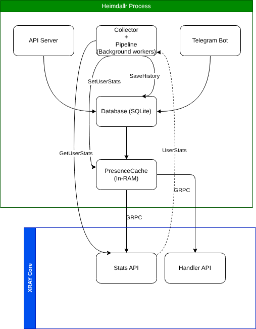

# Архитектура Heimdallr

> **Версия документа:** 0.3.0  
> **Последнее обновление:** 2025  
> **Статус:** актуально

---

## Содержание

1. [Обзор системы](#1-обзор-системы)
2. [Компоненты и их границы](#2-компоненты-и-их-границы)
3. [Схема взаимодействия компонентов](#3-схема-взаимодействия-компонентов)
4. [Модели данных](#4-модели-данных)
5. [Аутентификация и авторизация](#5-аутентификация-и-авторизация)
6. [Сбор статистики и присутствие](#6-сбор-статистики-и-присутствие)
7. [Жизненный цикл сессий](#7-жизненный-цикл-сессий)
8. [Механизм блокировки пользователей](#8-механизм-блокировки-пользователей)
9. [База данных](#9-база-данных)
10. [Graceful Shutdown](#10-graceful-shutdown)
11. [Архитектурные решения (ADR)](#11-архитектурные-решения-adr)
12. [Ключевые ограничения и известные компромиссы](#12-ключевые-ограничения-и-известные-компромиссы)

---

## 1. Обзор системы

**Heimdallr** — серверное приложение для управления и мониторинга VPN-доступа через [Xray-core](https://github.com/XTLS/Xray-core). Система предоставляет:

- веб-интерфейс для просмотра статистики трафика пользователей в реальном времени;
- двухфакторную аутентификацию через Telegram (без SMS, без сторонних сервисов);
- автоматическую блокировку пользователей при превышении лимита трафика;
- административный Telegram-бот для быстрого мониторинга.

**Ключевой принцип:** Heimdallr не является прокси — он управляет Xray через gRPC API. Весь пользовательский трафик проходит через Xray напрямую, Heimdallr только читает метрики и управляет конфигурацией.

### Стек технологий

| Слой | Технология | Обоснование |
|---|---|---|
| Backend | Go 1.22+ | Низкое потребление памяти, встроенная конкурентность, статическая типизация |
| База данных | SQLite + GORM | Нет зависимостей от внешних серверов, достаточно для нагрузки одного узла |
| Proxy-ядро | Xray-core (VLESS/XTLS) | gRPC API для управления пользователями без перезагрузки |
| Telegram | telebot.v3 | Long-polling, минимум зависимостей |
| Frontend | Next.js (статическая сборка) | Деплой как набор статических файлов, обслуживаемых Go-сервером |

---

## 2. Компоненты и их границы

Система состоит из пяти компонентов с чёткими границами ответственности.


### 2.1 API Server (`internal/api`)

**Ответственность:** HTTP API для фронтенда и административных операций.

- Обслуживает статические файлы Next.js из директории `out/`
- Маршруты аутентификации: регистрация, логин с 2FA, polling статуса сессии
- Маршруты данных: статистика трафика, история, управление пользователями
- Два уровня авторизации: `X-Admin-Token` (полный доступ) и JWT (пользовательский доступ)

**Зависимости:** Store, XrayClient, PresenceCache, TelegramBot (как Notifier)

### 2.2 Telegram Bot (`internal/bot`)

**Ответственность:** интерактивный узел для 2FA и привязки аккаунтов.

- Обрабатывает `/start reg_{session_id}` — привязка Telegram при регистрации
- Обрабатывает `/start 2fa_{session_id}` — подтверждение входа
- Отправляет OTP-коды по запросу API-сервера
- Отправляет административные алерты (блокировка пользователей)
- Доступ к `/stats` только для администратора (проверка по `TG_ADMIN_ID`)

**Зависимости:** Store (как `SessionApprover`, `WebUserActivator`), XrayClient (как `StatsProvider`)

### 2.3 Collector (`internal/collector`)

**Ответственность:** фоновый опрос Xray каждые N секунд (по умолчанию 30 с).

- Получает список всех пользователей из БД
- Запрашивает статистику трафика у каждого через `xray.GetUserStats`
- Обновляет `PresenceCache` актуальными данными (uplink/downlink)
- Сохраняет снимок в `user_history` для построения графиков
- При превышении лимита отправляет задачу в `Pipeline`

**Зависимости:** Store, XrayClient, PresenceCache, Pipeline

### 2.4 Pipeline + Bouncer (`internal/collector`)

**Ответственность:** асинхронная обработка задач блокировки пользователей.

`Pipeline` — конкурентная очередь задач (буфер 100, 3 воркера по умолчанию) чтобы если будет много операций они не забили всю память а просто подождали очереди выполнения своей задачи.  
`Bouncer` — исполнитель: обновляет статус в БД, удаляет пользователя из Xray inbound, отправляет алерт в Telegram если пользователь превысил лимиты трафика или по каким-нибудь другим причинам.

Разделение Pipeline/Bouncer сделано намеренно: коллектор не блокируется на тяжёлых операциях с Xray. Основной тик коллектора завершается быстро, блокировка происходит асинхронно.

### 2.5 PresenceCache (`internal/collector`)

**Ответственность:** in-memory кэш online-статусов и последних значений трафика.

- Коллектор пишет в кэш на каждом тике
- API читает из кэша — ни один HTTP-запрос не идёт в Xray напрямую
- Пользователь считается online, если трафик менялся в течение последних 10 секунд
- При рестарте кэш пуст — восстанавливается за один тик коллектора (30 с)

---

## 3. Схема взаимодействия компонентов

### 3.1 Нормальный цикл сбора статистики

```
Collector.tick() каждые 30 с
        │
        ├─ Store.GetAllUsers()        ← список всех пользователей из SQLite
        │
        └─ для каждого user:
               │
               ├─ XrayClient.GetUserStats(email)   ← gRPC запрос к Xray
               │          │
               │          └─► PresenceCache.SetStats(email, up, down)
               │                    └─ обновляет lastActivity если трафик вырос
               │
               ├─ если user.TrafficLimit > 0 && (up+down) > limit:
               │          └─► Pipeline.Submit(user)    ← неблокирующий
               │
               └─ Store.SaveHistory(UserHistory{...})  ← запись в SQLite
```

### 3.2 Запрос статуса online из API

```
GET /api/stats
        │
        └─ PresenceCache.GetAllStats()
                │
                └─► []UserStats{email, uplink, downlink, online}
                         ← ни одного обращения к Xray или SQLite
```

Это ключевое архитектурное решение: API никогда не ходит в Xray напрямую. Актуальность данных ограничена интервалом коллектора (`COLLECT_INTERVAL`), что является приемлемым компромиссом для дашборда мониторинга.

---

## 4. Модели данных

### 4.1 User (Xray-аккаунт)

Представляет пользователя в Xray. Управляется через Admin API.

```
User
├── id            uint        PK, autoincrement
├── email         string      UNIQUE, идентификатор в Xray
├── telegram_id   *int64      UNIQUE NULLABLE, для команды /stats
├── uuid          string      UNIQUE, VLESS UUID (колонка: xray_uuid)
├── inbound_tag   string      имя inbound в конфиге Xray
├── flow          string      VLESS flow (legacy поле)
├── vless_flow    string      VLESS flow (актуальное поле, приоритет)
├── traffic_limit int64       байты, 0 = без лимита
├── is_blocked    bool        INDEX
├── expires_at    *time.Time  INDEX, NULLABLE
├── created_at    time.Time
└── updated_at    time.Time
```

**Примечание:** поле `uuid` хранится в колонке `xray_uuid` — legacy-совместимость, переименование не требуется.

### 4.2 WebUser (аккаунт веб-интерфейса)

Намеренно отделён от `User`. WebUser может существовать без Xray-аккаунта.

```
WebUser
├── id             uint           PK
├── email          string         UNIQUE
├── password_hash  string         bcrypt, не сериализуется в JSON
├── display_name   string
├── telegram_id    *int64         UNIQUE NULLABLE, NULL до привязки
├── status         WebUserStatus  PENDING | ACTIVE | SUSPENDED
├── last_login_ip  string
├── last_login_at  *time.Time
├── created_at     time.Time
└── updated_at     time.Time
```

**Жизненный цикл статуса:**
```
PENDING → ACTIVE     (бот получил /start reg_{id}, ActivateWebUser)
ACTIVE  → SUSPENDED  (администратор, SetWebUserStatus)
SUSPENDED → ACTIVE   (администратор, SetWebUserStatus)
```

### 4.3 AuthSession (временная сессия)

Связывает веб-действие с подтверждением в Telegram. TTL: 10 минут.

```
AuthSession
├── id          string        PK, UUID v4
├── web_user_id uint          INDEX → WebUser.id
├── kind        SessionKind   REGISTER | LOGIN_2FA
├── otp_code    string        заполняется только для LOGIN_2FA
├── status      SessionStatus PENDING | APPROVED | EXPIRED
├── expires_at  time.Time
└── created_at  time.Time
```

### 4.4 OTPCode

Один активный код на пользователя (upsert при создании).

```
OTPCode
├── id         uint       PK
├── admin_id   int64      UNIQUE INDEX (один код на пользователя)
├── code       string     6 цифр, не сериализуется в JSON
├── expires_at time.Time  TTL: 5 минут
└── used       bool       помечается сразу после верификации
```

### 4.5 UserHistory (временной ряд трафика)

Снимки трафика для построения графиков. Таблица только растёт.

```
UserHistory
├── id            uint       PK
├── email         string     INDEX (не UNIQUE — много записей на пользователя)
├── downlink      int64      байты
├── uplink        int64      байты
├── active_conns  int
├── is_blocked    bool
└── created_at    time.Time  INDEX
```

---

## 5. Аутентификация и авторизация

Система имеет два полностью независимых auth-потока.

### 5.1 Административный доступ (статический токен)

Используется для управления пользователями Xray. Токен передаётся в заголовке:

```
X-Admin-Token: <API_ADMIN_TOKEN>
```

Токен задаётся переменной окружения `API_ADMIN_TOKEN` при старте. Не ротируется автоматически — смена требует перезапуска.

### 5.2 Пользовательская аутентификация (Telegram 2FA + JWT)

Полный флоу регистрации нового пользователя:

```
Браузер                     API Server              Telegram Bot          SQLite
   │                            │                        │                   │
   │── POST /api/auth/register ─►│                        │                   │
   │   {email, password}        │                        │                   │
   │                            ├── bcrypt(password) ────►│                   │
   │                            ├── CreateWebUser() ──────────────────────────►│
   │                            ├── SaveSession(REGISTER)─────────────────────►│
   │◄── {session_id, tg_url} ───│                        │                   │
   │                            │                        │                   │
   │  [Пользователь открывает tg_url: t.me/bot?start=reg_{session_id}]        │
   │                            │                        │                   │
   │                            │                        │◄── /start reg_id  │
   │                            │                        ├── FindValidSession()►│
   │                            │                        ├── ActivateWebUser()─►│
   │                            │                        ├── UpdateSession(APPROVED)►│
   │                            │                        │── "✅ Linked" ──►TG│
   │                            │                        │                   │
   │── GET /api/auth/session/{id}►│                       │                   │
   │◄── {status: "APPROVED"} ───│                        │                   │
   │                            ├── FindValidSession()────────────────────────►│
   │◄── {jwt_token} ────────────│                        │                   │
```

Флоу входа существующего пользователя (2FA):

```
Браузер                     API Server              Telegram Bot
   │                            │                        │
   │── POST /api/auth/login ────►│                        │
   │   {email, password}        │                        │
   │                            ├── bcrypt.Compare()     │
   │                            ├── generateOTP(6 цифр) │
   │                            ├── SaveOTP()            │
   │                            ├── SaveSession(LOGIN_2FA)│
   │                            ├── bot.SendOTP(tg_id, code)──►│
   │◄── {session_id, tg_url} ───│                        │─── "Код: XXXXXX"──►TG
   │                            │                        │
   │   [Два параллельных пути подтверждения]             │
   │                            │                        │
   │   Путь 1 (OTP):            │   Путь 2 (Telegram):   │
   │── POST /api/auth/verify ───►│  [Пользователь кликает tg_url]
   │   {session_id, otp}        │                        │◄── /start 2fa_id
   │                            ├── FindValidOTP()       ├── UpdateSession(APPROVED)
   │                            ├── MarkOTPUsed()        │
   │                            ├── UpdateSession(APPROVED)
   │◄── {jwt_token} ────────────│                        │
```

**Оба пути завершают одну и ту же сессию.** Первый успешный вызов побеждает — второй получит `ErrNotFound` и ничего не сломает.

### 5.3 JWT

JWT выдаётся после успешной аутентификации. Используется для последующих запросов к API:

```
Authorization: Bearer <jwt_token>
```

Секрет задаётся переменной `JWT_SECRET`. При рестарте все активные токены остаются валидными (секрет не меняется).

---

## 6. Сбор статистики и присутствие

### 6.1 Почему PresenceCache, а не прямые запросы к Xray

Прямой запрос к Xray из каждого HTTP-запроса создал бы несколько проблем:

- **Latency:** gRPC round-trip к Xray на каждый запрос дашборда
- **Нагрузка:** при N одновременных пользователях дашборда — N × M запросов к Xray (M = количество VPN-пользователей)
- **Связность:** недоступность Xray роняет дашборд

С PresenceCache:
- Дашборд отвечает за O(1) из памяти
- Xray опрашивается строго раз в `COLLECT_INTERVAL`
- Xray может быть временно недоступен — дашборд продолжает работать с устаревшими данными

**Компромисс:** данные устаревают на `COLLECT_INTERVAL` (по умолчанию 30 с). Это приемлемо для мониторинга.

### 6.2 Определение online-статуса

```go
// Пользователь online если трафик менялся в течение последних 10 секунд
timeout = 10 * time.Second

// При каждом тике коллектора:
if uplink > prev.totalUplink || downlink > prev.totalDownlink {
    lastActivity = now  // обновляем только при приросте трафика
}
online = time.Since(lastActivity) < timeout
```

Хранение `lastActivity` отдельно от значений трафика позволяет корректно различать "активен только что" и "давно не активен, но данные есть".

---

## 7. Жизненный цикл сессий

```
                    ┌─────────┐
                    │ PENDING │  ← SaveSession() при логине/регистрации
                    └────┬────┘
                         │
            ┌────────────┴────────────┐
            │                         │
    Бот подтвердил             TTL истёк (10 мин)
    или OTP введён             или явная отмена
            │                         │
       ┌────▼────┐              ┌──────▼──────┐
       │APPROVED │              │   EXPIRED   │
       └────┬────┘              └─────────────┘
            │
     Фронт получил JWT
     через polling
            │
     Session удаляется
     фоновым джобом
```

**Фоновая чистка** запускается каждые 5 минут из `main.go`:

```go
store.DeleteExpiredSessions(ctx)  // expires_at < now OR status = EXPIRED
```

При старте приложения также выполняется `DeleteExpiredOTPs` — очистка накопленных кодов.

---

## 8. Механизм блокировки пользователей

Автоматическая блокировка при превышении лимита трафика:

```
Collector.tick()
    │
    └─ (up + down) > user.TrafficLimit
              │
              └─► Pipeline.Submit(user)   ← буфер 100 задач, неблокирующий
                          │
                  ┌───────▼────────┐
                  │  Worker (x3)   │  ← 3 горутины читают из канала
                  └───────┬────────┘
                          │
                  Bouncer.BlockUser(user)
                          │
                  ┌───────┴────────────────────────┐
                  │                                 │
          Store.UpdateStatus()            XrayClient.RemoveUser()
          (is_blocked=true)               (удалить из inbound)
                  │                                 │
                  └───────────┬─────────────────────┘
                              │
                    Bot.SendAlert("🚨 blocked: email")
```

**Переполнение очереди:** если буфер Pipeline заполнен (100 задач), новая задача дропается с ошибкой в лог. Это защита от каскадного роста горутин при недоступности Xray.

**Идемпотентность:** повторный `BlockUser` для уже заблокированного пользователя безопасен — коллектор пропускает пользователей с `is_blocked=true` в начале тика.

---

## 9. База данных

### 9.1 SQLite с WAL

```
DSN: file.db?_journal_mode=WAL&_busy_timeout=5000
MaxOpenConns: 1
```

**WAL (Write-Ahead Logging)** позволяет одновременные чтения и запись без блокировок. Это критично: коллектор постоянно пишет историю, API одновременно читает пользователей.

**`MaxOpenConns: 1`** — SQLite является файлом, не сервером. Одно соединение — системный семафор на уровне драйвера, предотвращающий конфликты записи.

**`busy_timeout: 5000 мс`** — если соединение занято, драйвер ждёт до 5 секунд перед возвратом ошибки.

### 9.2 Автомиграция

GORM выполняет `AutoMigrate` при каждом старте — добавляет новые колонки и индексы. Удаление колонок не происходит автоматически — это защита от случайной потери данных.

### 9.3 Разделение Store по файлам

Весь доступ к БД инкапсулирован в пакете `internal/db`. Файлы разделены по предметным областям:

```
internal/db/
├── store.go      — инициализация, миграция
├── user.go       — CRUD для Xray-пользователей
├── webUser.go    — CRUD для веб-аккаунтов
├── session.go    — управление auth-сессиями
├── otp.go        — управление OTP-кодами
└── history.go    — запись и чтение истории трафика
```

Все методы возвращают `db.ErrNotFound` вместо `gorm.ErrRecordNotFound` — вызывающий код не зависит от конкретной ORM.

---

## 10. Graceful Shutdown

Компоненты останавливаются в строго обратном порядке запуска:

```
os.Signal (SIGTERM / SIGINT)
        │
        ▼
collectorCancel()          // 1. Коллектор — прекращаем писать в БД
        │
tgBot.Api.Stop()           // 2. Бот — завершаем long-polling
        │
apiServer.Shutdown(10s)    // 3. HTTP сервер — ждём завершения активных запросов
        │
xrayClient.Close()         // 4. gRPC соединение — закрываем последним
```

Таймаут shutdown — 10 секунд. Если API-сервер не успевает завершить запросы — контекст отменяется принудительно.

---

## 11. Архитектурные решения (ADR)

### ADR-001: Разделение User и WebUser

**Контекст:** пользователь веб-интерфейса и пользователь Xray — разные сущности с разными жизненными циклами.

**Решение:** две отдельные таблицы. WebUser отвечает за auth в веб-UI, User отвечает за доступ в Xray. Связь — по `email`.

**Следствие:** можно создать веб-аккаунт без Xray-аккаунта (например, для биллинга до оплаты). Xray-пользователь может существовать без веб-аккаунта (legacy-пользователи).

### ADR-002: PresenceCache вместо прямых запросов к Xray

**Контекст:** несколько параллельных клиентов дашборда создадут линейный рост нагрузки на Xray.

**Решение:** единственный источник актуальных данных — коллектор. API читает только из памяти.

**Следствие:** данные устаревают максимум на `COLLECT_INTERVAL`. При рестарте — 30 секунд пустого кэша. Принято как допустимый компромисс.

### ADR-003: Два параллельных пути 2FA

**Контекст:** пользователь может подтвердить вход либо кодом OTP, либо кликом в Telegram.

**Решение:** оба пути работают независимо и завершают одну сессию. Первый успешный вызов переводит сессию в APPROVED, второй получает ErrNotFound и завершается без ошибки для пользователя.

**Следствие:** UX более гибкий. Безопасность не снижается — для подтверждения нужен доступ либо к Telegram-аккаунту, либо к полученному коду.

### ADR-004: Pipeline для блокировок

**Контекст:** блокировка включает запрос к Xray gRPC. Если Xray недоступен — нельзя блокировать основной тик коллектора.

**Решение:** отдельная очередь с воркерами. Коллектор только пишет в канал — без ожидания результата.

**Следствие:** при недоступности Xray задачи копятся в буфере. При переполнении (>100) — дропаются с логом. Дублирование задач возможно (пользователь попадёт в очередь на следующем тике), но Bouncer идемпотентен.

### ADR-005: Один активный OTP на пользователя

**Контекст:** без ограничения пользователь мог бы генерировать бесконечно много активных кодов.

**Решение:** `UNIQUE INDEX` на `admin_id` + `ON CONFLICT UPDATE` при сохранении. Новый запрос кода инвалидирует предыдущий.

**Следствие:** параллельные попытки входа с разных устройств возможны только если второй вход произошёл до истечения первого OTP — в этом случае первый код перестаёт работать.

---

## 12. Ключевые ограничения и известные компромиссы

| Ограничение | Причина | Когда становится проблемой |
|---|---|---|
| SQLite — одно соединение на запись | Природа SQLite как файла | >100 RPS записей (маловероятно для одного узла) |
| PresenceCache живёт только в памяти | Простота, нет Redis | При рестарте — 30 с неактуальных данных |
| JWT-секрет не ротируется | Нет механизма ротации | При компрометации секрета — ручная смена + перезапуск |
| Pipeline buffer = 100 | Защита от OOM | Массовые одновременные превышения лимитов |
| Один активный OTP на пользователя | Безопасность | Параллельный вход с двух устройств инвалидирует первый код |
| Нет rate limiting на /api/auth | Не реализовано | Brute-force атаки на OTP (6-значный код — 1 млн вариантов) |

> **TODO:** добавить rate limiting на `/api/auth/verify` — ограничение попыток ввода OTP по IP и по `session_id`.